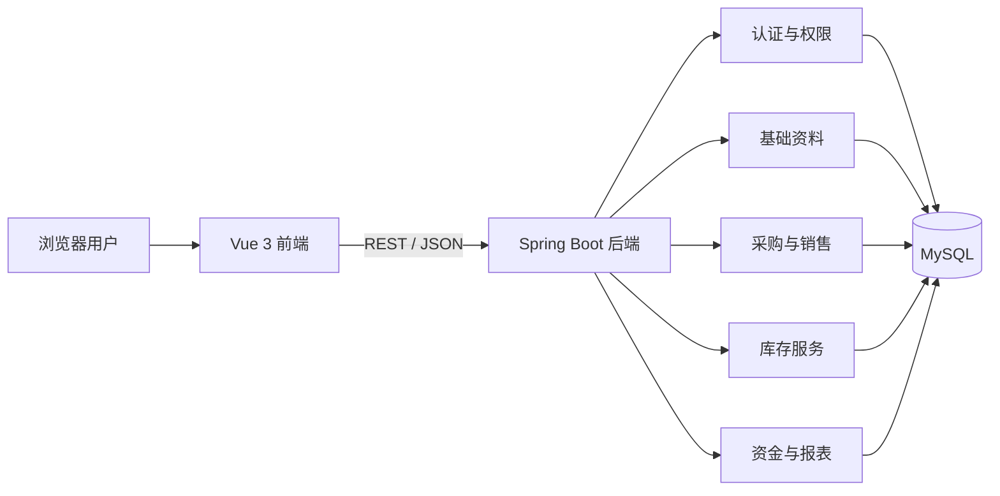

# B2B 云进销存 ERP 系统项目规划

> 版本：V1.0  
> 技术栈：Spring Boot + Vue 3 + MySQL  
> 原始计划基线：4 人小组、6 周开发周期  
> 说明：本文档不保存任何真实数据库账号或密码，所有敏感配置必须通过环境变量或未提交的本地配置文件提供。

> 当前实际条件已调整为 5 人、约 1 周、完成整体功能的 50%～60%。实际执行以 [ONE_WEEK_TASKS.md](ONE_WEEK_TASKS.md) 为准，本文件保留为完整项目参考。

## 1. 项目目标

建设一个面向多门店、多仓库场景的 B2B 云进销存 ERP 系统，打通以下两条核心业务链路：

1. 采购单 → 采购入库 → 应付款 → 付款 → 供应商对账。
2. 销售单 → 销售出库 → 应收款 → 收款 → 客户对账。

一期以“业务闭环正确、数据可追溯、权限可控制”为核心，不以完整复刻原型的全部页面为目标。

### 验收标准

- 用户可以登录，并只能访问角色授权的菜单和数据范围。
- 商品、客户、供应商、门店、仓库等基础资料可以正常维护。
- 采购、销售、入库、出库、收付款全流程可运行。
- 每一次库存增减都有来源单据和库存流水，库存不能被页面直接修改。
- 业务单据支持草稿、审核、完成、取消等状态，并阻止非法状态跳转。
- 首页和核心报表的数据与业务单据一致。
- 关键业务具备后端自动化测试，核心页面具备联调测试记录。

## 2. 一期范围

### 2.1 P0：必须完成

| 模块 | 功能 |
| --- | --- |
| 登录与权限 | 登录、退出、用户、角色、菜单权限、按钮权限、数据权限 |
| 组织资料 | 企业信息、门店、仓库 |
| 商品资料 | 商品、商品分类、单位、属性、标签 |
| 客户资料 | 客户、客户分类、客户等级、客户标签 |
| 供应商资料 | 供应商、供应商分类 |
| 采购 | 采购单、采购退货申请单、采购入库、采购退货出库 |
| 销售 | 销售单、销售退货申请单、销售出库、销售退货入库 |
| 库存 | 库存查询、库存流水、入库明细、出库明细、库存盘点、库存调拨、库存调整 |
| 资金 | 收款单、付款单、其他收支、资金流水、应收应付 |
| 报表 | 销售明细、采购明细、库存余额、库存预警、客户对账、供应商对账 |
| 系统设置 | 个人信息、修改密码、操作日志 |

### 2.2 P1：时间允许再做

- 借入、借出管理。
- 消息通知中心。
- Excel 导入导出。
- 销售利润表及更多维度汇总报表。
- 首页图表和待办提醒。
- 审核备注、反审核和单据打印。

### 2.3 暂不纳入一期

- 完整财务会计、会计凭证、总账和税务系统。
- 发票平台、银行、物流和第三方商城对接。
- 通用工作流设计器。
- 移动端、小程序和原生 App。
- 微服务拆分、分布式事务和复杂消息队列。

## 3. 总体架构



### 3.1 后端建议

- Java 17。
- Spring Boot 3.x。
- Spring Security + JWT 负责认证授权。
- MyBatis-Plus 负责数据访问。
- Jakarta Validation 负责参数校验。
- springdoc-openapi / Knife4j 生成接口文档。
- Flyway 管理数据库版本，禁止依靠手工修改线上表结构。
- JUnit 5 + Spring Boot Test 编写测试。

后端一期采用单体模块化架构，按业务模块组织代码。课程项目阶段不建议拆微服务。

### 3.2 前端建议

- Vue 3 + TypeScript + Vite。
- Element Plus。
- Vue Router。
- Pinia。
- Axios。
- ECharts 用于首页和报表图表。
- Vitest 用于工具函数和关键状态逻辑测试。

### 3.3 推荐目录结构

```text
erp-system/
├─ erp-server/                 # Spring Boot 后端
│  ├─ src/main/java/.../
│  │  ├─ common/              # 返回体、异常、工具、通用枚举
│  │  ├─ security/            # JWT、认证、授权、数据权限
│  │  ├─ system/              # 用户、角色、日志
│  │  ├─ masterdata/          # 商品、客户、供应商、组织资料
│  │  ├─ purchase/            # 采购业务
│  │  ├─ sales/               # 销售业务
│  │  ├─ inventory/           # 库存业务
│  │  ├─ finance/             # 收付款、应收应付
│  │  └─ report/              # 报表查询
│  └─ src/main/resources/
│     ├─ db/migration/        # Flyway SQL
│     └─ application.yml
├─ erp-web/                    # Vue 3 前端
│  └─ src/
│     ├─ api/
│     ├─ assets/
│     ├─ components/
│     ├─ layouts/
│     ├─ router/
│     ├─ stores/
│     ├─ utils/
│     └─ views/
├─ docs/                       # 需求、接口、数据库、测试文档
└─ docker-compose.yml          # 本地联调环境，后期添加
```

## 4. 关键业务规则

### 4.1 单据状态

采购单和销售单建议采用统一的状态思路：

```text
草稿 DRAFT
  → 已审核 APPROVED
  → 部分执行 PARTIALLY_EXECUTED
  → 已完成 COMPLETED

草稿或已审核 → 已取消 CANCELLED
```

- 草稿可以编辑和删除。
- 已审核单据不能直接修改明细。
- 已产生出入库记录的单据不能直接取消，必须通过红冲、退货或反向单据处理。
- 状态变更必须由后端校验，前端隐藏按钮不能代替权限与状态校验。

### 4.2 库存规则

- 采购单审核不增加库存，采购入库确认后才增加库存。
- 销售单审核可以锁定库存，销售出库确认后才扣减实际库存。
- 库存余额表只保存当前结果，库存流水表保存完整过程。
- 所有库存变化必须同时写入业务单据、库存流水和库存余额，并处于同一数据库事务中。
- 是否允许负库存必须配置化；一期建议禁止负库存。
- 库存盘点只记录差异，盘点审核后生成库存调整流水。
- 库存调拨必须同时记录调出仓和调入仓两条流水。

### 4.3 资金规则

- 销售出库或销售单完成后生成应收款。
- 采购入库或采购单完成后生成应付款。
- 收款、付款支持部分核销，单据应显示未结金额。
- 金额字段使用 `DECIMAL(18,2)`，数量字段建议使用 `DECIMAL(18,4)`，禁止使用浮点类型保存金额。

### 4.4 多门店与数据权限

- 核心业务表必须包含企业、门店或仓库归属字段。
- 普通员工只能查看所属门店数据。
- 仓库管理员只能操作授权仓库。
- 总部角色可以查看所有门店的汇总数据。
- 后端查询必须自动附加数据范围条件，不能仅依赖前端传入门店 ID。

## 5. 数据库初步设计

### 5.1 通用字段

业务表统一包含以下字段：

```text
id                BIGINT
enterprise_id     BIGINT
created_by        BIGINT
created_at        DATETIME
updated_by        BIGINT
updated_at        DATETIME
deleted           TINYINT
version           INT
```

- 主键如果使用雪花 ID，返回前端时应序列化成字符串，避免 JavaScript 丢失精度。
- 单据编号需要唯一索引。
- 库存余额需要 `(warehouse_id, product_id)` 唯一索引。
- 常用查询条件如门店、仓库、客户、供应商、状态、业务日期需要建立组合索引。

### 5.2 表分组

| 分组 | 建议表 |
| --- | --- |
| 系统权限 | `sys_user`、`sys_role`、`sys_permission`、`sys_user_role`、`sys_role_permission`、`sys_operation_log` |
| 组织 | `org_enterprise`、`org_store`、`org_warehouse`、`org_user_store`、`org_user_warehouse` |
| 商品 | `md_product`、`md_product_category`、`md_unit`、`md_attribute`、`md_attribute_value`、`md_product_attribute`、`md_product_tag` |
| 客户 | `md_customer`、`md_customer_category`、`md_customer_level`、`md_customer_tag` |
| 供应商 | `md_supplier`、`md_supplier_category` |
| 采购 | `pur_order`、`pur_order_item`、`pur_return`、`pur_return_item` |
| 销售 | `sal_order`、`sal_order_item`、`sal_return`、`sal_return_item` |
| 出入库 | `inv_inbound`、`inv_inbound_item`、`inv_outbound`、`inv_outbound_item` |
| 库存 | `inv_stock_balance`、`inv_stock_movement`、`inv_transfer`、`inv_transfer_item`、`inv_count`、`inv_count_item`、`inv_adjustment`、`inv_adjustment_item` |
| 资金 | `fin_receivable`、`fin_receipt`、`fin_receipt_item`、`fin_payable`、`fin_payment`、`fin_payment_item`、`fin_other_transaction`、`fin_capital_flow` |

数据库详细设计应在编码前进一步产出 ER 图、字段字典和索引清单。

## 6. API 设计规范

- 基础路径：`/api/v1`。
- 资源路径使用复数，例如 `/api/v1/products`、`/api/v1/sales-orders`。
- 查询使用 `GET`，新增使用 `POST`，整体修改使用 `PUT`，局部动作使用明确的动作接口。
- 审核类接口示例：`POST /api/v1/sales-orders/{id}/approve`。
- 取消类接口示例：`POST /api/v1/sales-orders/{id}/cancel`。
- 分页统一使用 `page`、`size`，并限制最大 `size`。
- 所有接口统一返回业务码、提示信息、数据和追踪 ID。
- 业务异常使用明确错误码，例如库存不足、单据状态错误、权限不足。
- 接口文档、数据库字段和前端 TypeScript 类型保持一致。

建议返回格式：

```json
{
  "code": "SUCCESS",
  "message": "操作成功",
  "data": {},
  "traceId": "..."
}
```

## 7. 六周开发计划

| 周次 | 目标 | 主要交付物 |
| --- | --- | --- |
| 第 1 周 | 项目启动与基础框架 | 需求边界、ER 图 V1、项目脚手架、登录、权限基础、接口规范、数据库迁移基线 |
| 第 2 周 | 基础资料 | 企业、门店、仓库、商品、客户、供应商的前后端功能 |
| 第 3 周 | 采购与销售 | 采购单、销售单、审核状态、退货申请、单据联调 |
| 第 4 周 | 库存闭环 | 出入库、库存余额、库存流水、库存盘点、库存调拨 |
| 第 5 周 | 资金与报表 | 应收应付、收付款、对账单、核心统计报表、首页概览 |
| 第 6 周 | 集成与交付 | 权限补全、异常场景、测试、部署、演示数据、用户手册、答辩材料 |

每周结束时必须有可运行版本，不能把联调和测试全部堆到最后一周。

## 8. 四人小组分工建议

| 成员 | 主责 | 辅责 |
| --- | --- | --- |
| A：后端负责人 | 项目骨架、登录权限、公共组件、组织资料 | 代码审查、部署支持 |
| B：业务后端 | 商品资料、采购、销售、库存、资金 | 数据库设计、后端测试 |
| C：前端负责人 | Vue 工程、布局、路由、权限、公共组件 | 代码规范、前端构建 |
| D：业务前端与测试 | 基础资料、采购销售、库存资金、报表页面 | 联调、测试用例、演示文档 |

为了避免人员被单点卡住：

- A 与 B 互审后端代码。
- C 与 D 互审前端代码。
- 每个模块至少有一名前端和一名后端共同负责。
- 数据库结构变更必须由全组确认并通过 Flyway 脚本提交。

如果小组人数超过 4 人，可单独增加测试与运维负责人；少于 4 人则优先削减 P1 功能，不削减测试和数据一致性要求。

## 9. Git 协作规范

- `main`：可部署、可演示版本。
- `develop`：日常集成分支。
- `feature/<module>-<description>`：功能分支。
- `fix/<description>`：缺陷修复分支。
- 功能通过合并请求进入 `develop`，禁止所有人直接向 `main` 推送。
- 每个合并请求至少由一名同学审查。
- 提交信息建议使用 `feat`、`fix`、`docs`、`test`、`refactor`、`chore` 前缀。
- 前后端接口有变化时，同时修改接口文档和相关类型。

## 10. 测试与质量门槛

### 后端重点测试

- 登录、Token 失效和越权访问。
- 单据状态非法跳转。
- 库存不足时禁止出库。
- 重复提交不能重复扣减库存。
- 入库、出库、调拨事务回滚。
- 部分收付款与核销余额计算。
- 多门店数据隔离。

### 前端重点测试

- 路由和按钮权限。
- 表单校验和金额、数量精度。
- 分页、筛选、重置和详情回显。
- 重复点击提交按钮的防护。
- 后端错误信息的统一展示。

### 完成定义（Definition of Done）

一个功能只有满足以下条件才能标记完成：

1. 前后端代码已合并。
2. 数据库迁移脚本已提交。
3. 接口文档已更新。
4. 正常流程和至少两个异常流程已测试。
5. 没有阻断级控制台错误或后端异常。
6. 另一名同学完成代码审查。

## 11. 配置与安全

- 数据库地址、用户名、密码不得写入 Git 仓库。
- 后端使用 `DB_HOST`、`DB_PORT`、`DB_NAME`、`DB_USERNAME`、`DB_PASSWORD` 等环境变量读取配置。
- 仓库只提交无真实凭据的 `application-example.yml` 或 `.env.example`。
- 本地配置文件加入 `.gitignore`。
- 数据库账号使用最小权限，不应授予全局管理权限。
- 远程 MySQL 仅对需要的服务器或开发 IP 开放，不建议对公网任意地址开放 3306 端口。
- 开发库也需要定期备份，重大结构变更前先创建备份。
- 已经通过聊天或其他非密码管理工具传递过的密码，建议尽快轮换。

## 12. 风险与应对

| 风险 | 影响 | 应对措施 |
| --- | --- | --- |
| 原型页面过多 | 无法按期完成 | 先完成 P0 闭环，P1 按时间追加 |
| 前后端接口反复变化 | 联调延期 | 第 1 周固定接口规范，使用 OpenAPI 作为契约 |
| 库存逻辑错误 | 核心数据不可信 | 库存变更集中到库存服务，使用事务和幂等校验 |
| 多人直接改表 | 环境不一致 | 所有表结构变化使用 Flyway |
| 只做页面不做异常流程 | 演示时容易出错 | 每个功能按完成定义验收 |
| 公网数据库泄露 | 数据与服务器风险 | 密码轮换、IP 白名单、最小权限、禁止提交凭据 |

## 13. 项目交付物

- 前端和后端源代码。
- Flyway 数据库迁移脚本及初始化演示数据。
- ER 图和数据库字典。
- OpenAPI/Knife4j 接口文档。
- 测试用例与测试报告。
- 部署文档和环境变量清单。
- 用户操作手册。
- 演示账号及演示业务数据。
- 项目答辩 PPT 或项目总结报告。

## 14. 立即执行的启动清单

1. 全组确认 P0/P1 范围和最终截止日期。
2. 确认数据库名称，并轮换已公开传递的数据库密码。
3. 创建 Git 仓库、`main` 和 `develop` 分支及成员权限。
4. 创建 Spring Boot 和 Vue 3 工程骨架。
5. 完成 ER 图 V1 和第一版 Flyway 脚本。
6. 先打通“登录 → 商品资料 → 采购入库 → 库存查询”第一条纵向链路。
7. 第一周末进行一次可运行版本演示和计划复盘。
