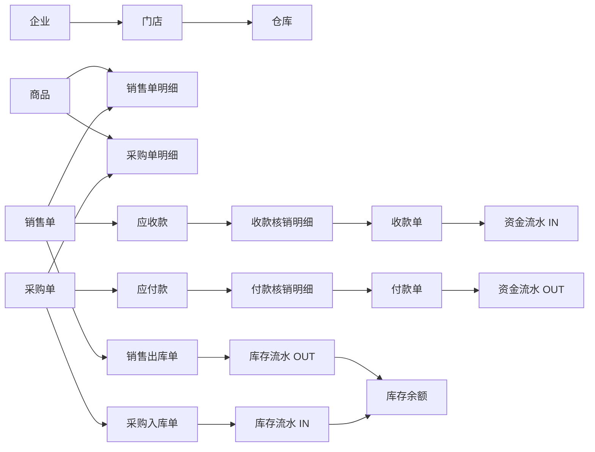

# B2B 云进销存 ERP 数据库设计 V1

对应建表脚本：[V1__init_schema.sql](../sql/V1__init_schema.sql)

## 1. 设计结果

第一版共设计 61 张表，先覆盖思维导图中的完整业务范围，后续再根据实际开发进度删减字段、补约束和优化索引。

| 表前缀 | 模块 | 表数量 | 说明 |
| --- | --- | ---: | --- |
| `org_` | 组织 | 3 | 企业、门店、仓库 |
| `sys_` | 系统 | 12 | 用户、角色、菜单、数据权限、日志、通知、字典、单号 |
| `md_` | 基础资料 | 15 | 商品、分类、属性、标签、客户、供应商、单位 |
| `sal_` | 销售 | 4 | 销售单、销售退货及各自明细 |
| `pur_` | 采购 | 4 | 采购单、采购退货及各自明细 |
| `inv_` | 库存 | 14 | 余额、流水、出入库、调拨、盘点、调整、借入借出 |
| `fin_` | 资金 | 9 | 账户、应收应付、收付款、其他收支、资金流水 |
|  | 合计 | 61 | 报表直接查询业务表，不单独建报表结果表 |

## 2. 核心业务关系



## 3. 一周项目优先实现的表

虽然脚本包含 61 张表，但一周内不需要全部开发。下面 29 张表构成主要演示闭环。

### P0：必须开发

```text
org_enterprise
org_store
org_warehouse

sys_user
sys_role
sys_menu
sys_user_role
sys_role_menu
sys_operation_log
sys_document_sequence

md_unit
md_product_category
md_product
md_customer
md_supplier

sal_order
sal_order_item
pur_order
pur_order_item

inv_inbound
inv_inbound_item
inv_outbound
inv_outbound_item
inv_stock_balance
inv_stock_movement

fin_account
fin_receipt
fin_payment
fin_capital_flow
```

### P1：页面有时间再开发

- 商品属性、商品标签、客户标签、客户等级和各类分类表。
- `fin_receivable`、`fin_receipt_item`、`fin_payable`、`fin_payment_item` 的完整核销逻辑。
- 销售退货和采购退货。
- 库存盘点、调拨、调整、借入借出。
- 字典、通知和详细数据权限。

P1 表可以先建出来但不写页面，不影响 P0 功能演示。

## 4. 命名与字段规范

### 4.1 表命名

- 组织：`org_`。
- 系统：`sys_`。
- 基础资料：`md_`。
- 销售：`sal_`。
- 采购：`pur_`。
- 库存：`inv_`。
- 资金：`fin_`。
- 单据主表使用业务名，明细表统一以 `_item` 结尾。

### 4.2 主键

- 第一版统一使用 `BIGINT AUTO_INCREMENT`，便于快速开发。
- Java 实体使用 `Long`。
- 如果后续换成雪花 ID，返回 Vue 前端时应序列化成字符串，防止 JavaScript 整数精度丢失。

### 4.3 金额和数量

- 金额：`DECIMAL(18,2)`，Java 使用 `BigDecimal`。
- 商品数量：`DECIMAL(18,4)`，Java 使用 `BigDecimal`。
- 成本单价：`DECIMAL(18,4)`。
- 折扣率、税率：`DECIMAL(8,4)`。
- 禁止用 `FLOAT` 或 `DOUBLE` 保存金额。

### 4.4 通用字段

大部分业务主表包含：

```text
enterprise_id  企业ID
created_by     创建人
created_at     创建时间
updated_by     更新人
updated_at     更新时间
deleted        逻辑删除标记
version        乐观锁版本号
```

明细表不单独设置逻辑删除，主单删除时由业务代码统一处理。

## 5. 单据与状态设计

状态字段使用 `VARCHAR`，不使用 MySQL `ENUM`，方便后续调整。

### 销售单

```text
DRAFT
APPROVED
PARTIALLY_OUTBOUND
COMPLETED
CANCELLED
```

### 采购单

```text
DRAFT
APPROVED
PARTIALLY_INBOUND
COMPLETED
CANCELLED
```

### 出入库、收付款等执行单

```text
DRAFT
CONFIRMED
CANCELLED
```

所有状态变化必须由后端业务方法完成，不能让前端直接提交任意状态值。

## 6. 库存数据规则

### 6.1 两张核心表

- `inv_stock_balance`：保存每个仓库、每个商品当前的库存结果。
- `inv_stock_movement`：保存每一次库存变化的完整过程。

### 6.2 更新顺序

确认入库或出库时，在一个数据库事务中执行：

1. 校验来源单据和当前状态。
2. 锁定对应的 `inv_stock_balance` 记录。
3. 校验出库数量是否足够。
4. 更新库存余额。
5. 新增库存流水。
6. 更新出入库单状态及来源单据已执行数量。
7. 提交事务。

禁止通过商品编辑页面直接修改库存数量。

### 6.3 可用库存

```text
available_quantity = quantity - locked_quantity
```

第一周如果不实现库存锁定，可始终令 `locked_quantity = 0`，但保留字段方便后续完善。

## 7. 应收应付和收付款

完整模式：

- 销售业务生成 `fin_receivable`。
- 一张 `fin_receipt` 可以通过多条 `fin_receipt_item` 核销多笔应收。
- 采购业务生成 `fin_payable`。
- 一张 `fin_payment` 可以通过多条 `fin_payment_item` 核销多笔应付。
- 收付款确认后生成 `fin_capital_flow` 并更新 `fin_account.current_balance`。

一周简化模式：

- 收款单直接关联客户，付款单直接关联供应商。
- 暂时不做核销页面。
- 收付款确认后只写资金流水。
- 应收应付列表可直接根据销售单、采购单金额和已收已付金额计算。

## 8. 数据快照

销售、采购、出入库明细中重复保存了以下商品字段：

```text
product_code
product_name
specification
unit_id
unit_price / unit_cost
```

这些是业务发生时的快照。即使以后修改商品名称或价格，历史单据仍然保持原样，因此不能只依赖 `product_id` 实时查询商品表展示历史单据。

## 9. 为什么暂不创建物理外键

V1 脚本使用逻辑外键，只建立关联字段和索引，没有声明 `FOREIGN KEY`：

- 五个人可以并行调整模块表，降低建表顺序和测试数据清理的阻碍。
- 逻辑删除场景下，物理级联删除不适合业务单据。
- 后续表结构稳定后，可以为关键基础资料关系增加物理外键。

没有物理外键并不代表不校验关联关系。新增订单、出入库和收付款时，后端仍需校验对应客户、供应商、商品、仓库是否存在且可用。

## 10. 报表对应数据来源

| 报表 | 主要来源表 |
| --- | --- |
| 销售明细表 | `sal_order`、`sal_order_item`、`md_customer`、`md_product` |
| 按商品销售汇总 | `sal_order`、`sal_order_item` |
| 按客户销售汇总 | `sal_order`、`sal_order_item`、`md_customer` |
| 销售利润表 | `sal_order_item`、`inv_outbound_item` |
| 采购明细表 | `pur_order`、`pur_order_item`、`md_supplier`、`md_product` |
| 按商品采购汇总 | `pur_order`、`pur_order_item` |
| 按供应商采购汇总 | `pur_order`、`pur_order_item`、`md_supplier` |
| 商品库存余额 | `inv_stock_balance`、`md_product`、`org_warehouse` |
| 商品库存预警 | `inv_stock_balance`、`md_product.min_stock` |
| 库存流水 | `inv_stock_movement` |
| 客户对账单 | `fin_receivable`、`fin_receipt_item`、`fin_receipt` |
| 供应商对账单 | `fin_payable`、`fin_payment_item`、`fin_payment` |
| 资金流水 | `fin_capital_flow`、`fin_account` |

报表 V1 直接使用查询和聚合生成，不建立独立报表表。

## 11. 后续优化清单

1. 根据真实查询 SQL 调整组合索引，而不是继续盲目加索引。
2. 确认是否需要批次、保质期和序列号级库存；当前批次字段只在出入库明细中预留。
3. 确认销售出库后还是销售单审核后生成应收款。
4. 确认采购入库后还是采购单审核后生成应付款。
5. 增加数据库 `CHECK` 约束或后端校验，限制数量和金额范围。
6. 评估唯一索引与逻辑删除的配合策略。
7. 补充初始化菜单、角色、管理员、字典和演示数据脚本。
8. 表结构稳定后再决定是否增加物理外键。
9. 高数据量下考虑库存流水和操作日志按时间归档。
10. 补充数据库备份和迁移回滚方案。
