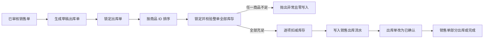

# 成员 5：库存、首页与部署答辩说明

## 1. 我负责的范围

我负责系统中的库存闭环、首页统计、库存报表和部署交付，主要包含：

- 采购入库：由已审核采购单生成入库单，确认后增加库存。
- 销售出库：由已审核销售单生成出库单，确认前校验库存，确认后扣减库存。
- 退货库存：销售退货入库、采购退货出库。
- 库存余额：查询每个企业、仓库、商品当前的库存数量和金额。
- 库存流水：记录每次库存变化前后的数量、成本、来源单据和操作人。
- 首页统计：展示库存金额、低库存、待处理出入库和本月采购销售数据。
- 库存报表：按仓库和商品筛选，汇总数量、金额、预警数、仓库数和商品数。
- 工程交付：后端测试与打包、前端构建、服务器部署说明。

本周明确不做批次、序列号、保质期、盘点、调拨、借入借出和高并发压测，避免范围失控。

## 2. 一句话说明设计

系统用 `inv_stock_balance` 保存“现在还有多少库存”，用 `inv_stock_movement` 保存“库存为什么变成这样”；所有确认出入库操作在一个数据库事务中完成，并通过行锁、状态校验和整单预校验避免重复确认、超卖及半张单据成功。

## 3. 核心业务链路

### 3.1 采购入库


确认入库的关键操作全部位于 `@Transactional` 方法内。任意一步出现异常，库存余额、库存流水、入库单和采购单状态都会一起回滚。

### 3.2 销售出库



这里不是“校验一个就扣一个”，而是先锁定并检查整张单的所有商品，全部充足后才开始扣减。因此第二个商品库存不足时，第一个商品也不会被提前扣掉。

## 4. 库存表为什么分成余额和流水

| 表 | 作用 | 特点 |
| --- | --- | --- |
| `inv_stock_balance` | 快速回答某仓库某商品现在有多少 | 一仓一商品一条记录，允许更新 |
| `inv_stock_movement` | 追溯每次库存变化的原因 | 只新增，不提供修改、删除接口 |
| `inv_inbound` / `inv_inbound_item` | 入库业务单据和明细 | 状态为 DRAFT、CONFIRMED、CANCELLED |
| `inv_outbound` / `inv_outbound_item` | 出库业务单据和明细 | 状态为 DRAFT、CONFIRMED、CANCELLED |

余额表存在唯一索引：

```sql
UNIQUE KEY uk_inv_stock_balance (enterprise_id, warehouse_id, product_id)
```

唯一索引既保证一仓一商品只有一条余额，也把企业加入唯一键，适配多租户数据隔离。

## 5. 成本计算

入库使用移动加权平均法：

```text
新库存金额 = 原库存金额 + 本次入库金额
新库存数量 = 原库存数量 + 本次入库数量
新平均成本 = 新库存金额 ÷ 新库存数量
```

例：原库存 10 件、总成本 100 元；本次入库 5 件、总成本 60 元：

```text
新数量 = 10 + 5 = 15
新金额 = 100 + 60 = 160
新平均成本 = 160 ÷ 15 = 10.6667 元
```

出库时使用当前移动平均成本计算出库成本：

```text
出库成本 = 出库数量 × 当前平均成本
出库后库存金额 = 出库前库存金额 - 出库成本
```

数量使用 `DECIMAL` / Java `BigDecimal`，不使用浮点数，避免金额精度问题。

## 6. 并发、事务和防重复

### 6.1 为什么使用行锁

确认操作先执行 `SELECT ... FOR UPDATE` 锁定出入库单。两个请求同时确认同一张单时，后到的请求必须等待；前一个请求提交后，后一个请求重新读到 `CONFIRMED`，随即被状态校验拒绝，不会再次改变库存。

库存余额也使用行锁。同一商品同时出库时，请求会按数据库锁顺序串行校验和扣减，避免两个请求都读到同一份旧库存。

### 6.2 为什么按商品 ID 排序

多商品出库前先按 `productId` 排序，再以一致顺序获取库存行锁。不同订单涉及相同商品时，统一锁顺序可以降低互相反向等待造成死锁的概率。

### 6.3 为什么还需要事务

行锁解决并发读取和修改顺序，事务保证多个表的修改要么全部成功，要么全部失败。二者解决的问题不同，不能互相替代。

### 6.4 幂等规则

- 只有 `DRAFT` 状态允许确认或取消。
- `CONFIRMED` 和 `CANCELLED` 再次提交会被后端拒绝。
- 防重复不能只依赖前端按钮 loading，后端必须重新检查状态。
- 库存不足会在任何库存更新和流水插入之前抛出异常。

## 7. 库存流水规则

当前实现的流水类型：

| 类型 | 方向 | 说明 |
| --- | --- | --- |
| `PURCHASE_IN` | IN | 采购入库 |
| `SALES_OUT` | OUT | 销售出库 |
| `SALES_RETURN_IN` | IN | 销售退货入库 |
| `PURCHASE_RETURN_OUT` | OUT | 采购退货出库 |

流水中的 `quantity` 始终保存正数，增减含义由 `direction` 判断。流水还记录 `beforeQuantity`、`afterQuantity`、`unitCost`、`amount`、来源单号、业务日期和操作人，因此可以审计库存从何而来、到哪里去。

## 8. 企业数据隔离

库存余额、库存流水、出入库单、商品和仓库查询都带 `enterpriseId` 条件。企业编号来自登录后的 JWT 用户信息，而不是由前端自由传入，防止修改请求参数读取其他企业的数据。

## 9. 首页和库存报表

首页 `/api/v1/dashboard/summary` 返回：

- 商品、客户、供应商、仓库数量。
- 当前库存金额和低库存数量。
- 本月已完成采购单数量、金额。
- 本月已完成销售单数量、金额。
- 草稿入库单、草稿出库单数量。
- 低库存前 5 条。

库存报表提供两个接口：

| 方法 | 地址 | 作用 |
| --- | --- | --- |
| GET | `/api/v1/reports/inventory` | 库存明细分页 |
| GET | `/api/v1/reports/inventory/summary` | 当前筛选条件的汇总 |

列表和汇总使用相同的仓库、商品编码、商品名称筛选条件，避免页面上“明细筛选了但汇总没变”的问题。

## 10. 库存接口清单

| 方法 | 地址 | 功能 |
| --- | --- | --- |
| GET | `/api/v1/inbounds` | 入库单分页查询 |
| GET | `/api/v1/inbounds/{id}` | 入库单及明细 |
| POST | `/api/v1/inbounds/from-purchase/{orderId}` | 从采购单生成入库单 |
| POST | `/api/v1/inbounds/from-sales-return/{returnId}` | 从销售退货生成入库单 |
| POST | `/api/v1/inbounds/{id}/confirm` | 确认入库 |
| POST | `/api/v1/inbounds/{id}/cancel` | 取消草稿入库单 |
| GET | `/api/v1/outbounds` | 出库单分页查询 |
| GET | `/api/v1/outbounds/{id}` | 出库单及明细 |
| POST | `/api/v1/outbounds/from-sales/{orderId}` | 从销售单生成出库单 |
| POST | `/api/v1/outbounds/from-purchase-return/{returnId}` | 从采购退货生成出库单 |
| POST | `/api/v1/outbounds/{id}/confirm` | 确认出库 |
| POST | `/api/v1/outbounds/{id}/cancel` | 取消草稿出库单 |
| GET | `/api/v1/stocks` | 库存余额和低库存查询 |
| GET | `/api/v1/stock-movements` | 库存流水查询 |

## 11. 主要代码入口

| 内容 | 文件 |
| --- | --- |
| 入库事务 | `erp-server/src/main/java/com/erp/inventory/service/InvInboundService.java` |
| 出库事务 | `erp-server/src/main/java/com/erp/inventory/service/InvOutboundService.java` |
| 库存查询与报表汇总 | `erp-server/src/main/java/com/erp/inventory/service/InvStockService.java` |
| 首页统计 | `erp-server/src/main/java/com/erp/inventory/service/DashboardService.java` |
| 库存报表接口 | `erp-server/src/main/java/com/erp/inventory/controller/InventoryReportController.java` |
| 入库事务测试 | `erp-server/src/test/java/com/erp/inventory/service/InvInboundServiceTest.java` |
| 出库事务测试 | `erp-server/src/test/java/com/erp/inventory/service/InvOutboundServiceTest.java` |
| 首页页面 | `erp-web/src/views/dashboard/index.vue` |
| 库存报表页面 | `erp-web/src/views/report/inventory/index.vue` |

## 12. 自动化测试覆盖

库存模块现有 5 个核心事务测试：

1. 入库后数量、金额及移动平均成本正确。
2. 入库会写入正确的 before/after 流水。
3. 已确认入库单不能重复确认。
4. 多商品出库中任一商品库存不足时，整单零写入。
5. 出库成功后数量、金额、流水和确认人正确，已确认出库单不能重复确认。

项目当前共 8 个后端测试，`mvn test` 已通过；前端 `npm run typecheck` 和 `npm run build` 已通过。

## 13. 五分钟演示顺序

1. 登录后打开首页，说明库存金额、低库存和待确认出入库来自真实数据库。
2. 进入采购单，选择已审核单据生成入库单。
3. 打开入库详情，确认商品、数量和成本，再点击确认入库。
4. 进入库存查询，展示库存数量增加、平均成本和库存金额变化。
5. 进入库存流水，展示 `PURCHASE_IN` 的变化前、变化后和来源单号。
6. 进入销售单生成出库单并确认，展示库存减少及 `SALES_OUT` 流水。
7. 选一张库存不足的销售单，展示系统拒绝整单出库。
8. 进入库存报表，按仓库或商品筛选，说明汇总卡片与明细同步变化。

演示前准备一张已审核采购单、一张库存充足的已审核销售单和一张库存不足的已审核销售单，避免现场临时录入耗时。

## 14. 高频答辩问题

**问：为什么不直接用流水求当前库存？**  
答：流水适合审计，但每次查询都聚合全部历史流水会越来越慢。余额表负责快速查询，流水表负责追溯，两者在同一事务内更新保证一致。

**问：库存不足时如何保证前面的商品没被扣？**  
答：后端先锁定并校验整单全部库存，全部通过后才进入第二轮扣减；即使后续出现异常，事务也会整体回滚。

**问：用户连续点击两次确认怎么办？**  
答：前端按钮会 loading，但真正的保证在后端。确认时锁定单据行并检查状态，第一笔提交后第二笔读到的状态不再是 DRAFT，因此被拒绝。

**问：两个用户同时出同一个商品怎么办？**  
答：查询库存使用 `FOR UPDATE` 行锁。第二个事务必须等待第一个提交，再用最新可用库存重新校验，因此不会基于旧库存超卖。

**问：为什么金额不用 double？**  
答：double 是二进制浮点数，十进制金额可能产生精度误差；数据库使用 DECIMAL，Java 使用 BigDecimal，并明确舍入位数。

**问：如何防止不同企业互相看到数据？**  
答：企业编号从登录用户中取得，所有库存相关查询都增加 enterpriseId 条件，前端不能自行指定企业编号。

**问：当前还有哪些不足？**  
答：实训版本暂未实现批次、序列号、盘点、调拨和库存预占；目前重点是把采购、销售、退货、库存和报表主闭环做正确。生产系统还需要更强的单号生成器、并发压测、监控告警和灾备。

## 15. 可直接照读的个人陈述

我主要负责库存、首页统计、库存报表和部署。库存模块不是简单的增删改查，核心是保证业务一致性。系统通过余额表保存当前库存，通过流水表记录每次变化；确认出入库时使用数据库事务和行锁，只有草稿单据可以确认。销售出库会先锁定并校验整张单的所有商品，全部充足后才扣库存，防止半张单成功。采购入库采用移动加权平均法计算成本，所有金额和数量都使用 BigDecimal。首页和库存报表使用真实数据库统计，并按登录企业隔离数据。最后我补充了核心事务自动化测试，并完成了后端打包、前端构建和部署文档。
